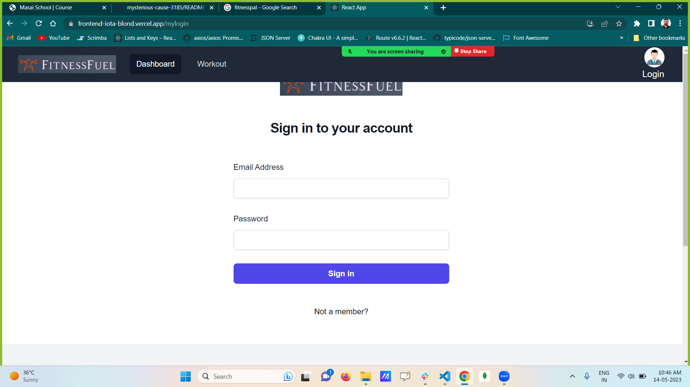
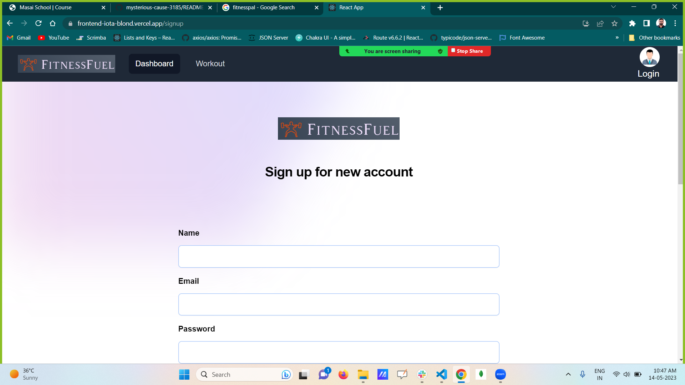
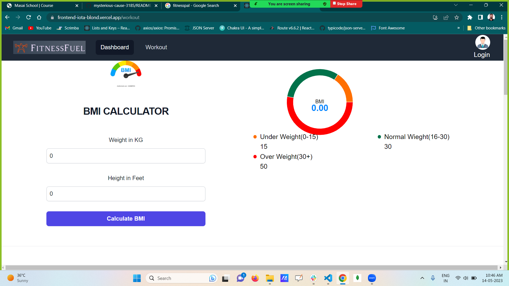
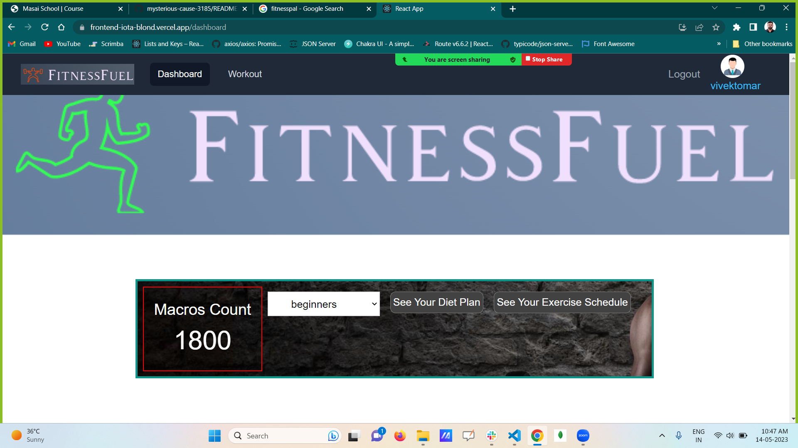

# FitnessFuel

# FitnessFuel 

FitnessFuel  simplifies nutrition and calorie tracking, provides the data you want, and helps you make sense of it all. 
It also provide execrise and diet plan according to your need (begginners, intermediate , expert) 

A Full Stack , Collaborative project built by a team of 4 executed in 2 days.

## Demo  🎥

- Deployed Link:- [Enjoy the Experience](https://frontend-iota-blond.vercel.app/)
- Backend:- [Infinity Stone Server](https://impossible-seal-coat.cyclic.app/)

## Tech Stack 💻

- React
- Typescript
- TailwindCss
- MongoDB
- Mongoose
- MongoDb Atlas

## Snapshots :camera:
* Landing page (Home page) 

* Sign-In page
 

* Signup

* Landing page (Workout page) 

* Dashboard page

## Contributors  😇

- 👤 [Vivek Singh Tomar](https://github.com/VivekTomar03)

-     Key-Responsibility -> Backend + Dhashboard 

- 👤 [Sudip Chowdhury](https://github.com/Sudip-C)

-     Key-Responsibility -> Dhashboard + api data

- 👤 [Md-Faizan](https://github.com/mdfaizan973)

-     Key-Responsibility -> UI For Home Page + workoutpage

- 👤 [Dharmik puri Goswami](https://github.com/dharmikpuri)
-     Key-Responsibility ->Login Signup Page

